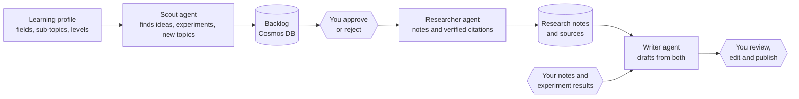

# Blog Content Pipeline

A multi-agent pipeline that turns a personal learning profile into researched, cited blog drafts, with a human making every publishing decision.

The workflow it supports: **learn a topic → run small experiments → write up what you understood, backed by research and your own results → publish.** Three agents (Scout, Researcher, Writer) handle the preparation around that loop. They share one backlog in Cosmos DB, and a local web app gives you a single place to review everything. Nothing is approved or published automatically.

## How it works



Agents never call each other. They communicate only through the shared backlog, so each one can be run, tested and replaced on its own.

## Agents

| Agent | Role | Status |
|---|---|---|
| **Scout** | Reads your profile and backlog, searches the web, and proposes post ideas (trending, refresher, deep-dive, or small hands-on experiments). Suggests new sub-topics and whole new fields for you to accept or dismiss. | Implemented |
| **Researcher** | Takes an approved idea and produces structured notes with citations. Every cited URL must have appeared in that run's search results, so a source can never be invented. | Planned |
| **Writer** | Drafts a post from the research notes plus your own notes and experiment results, with every citation and first-person claim traced to its source. | Planned |
| **Review web app** | Local FastAPI app to review ideas, inspect agent runs step by step, manage suggestions and edit the profile. | Implemented (Ideas, Runs, Suggestions, Profile) |

## Scout in detail

- **Profile-driven.** The profile is a set of fields (for example `agents`, `computer-vision`, `system-design`), each with sub-topics at a level: `know` (only advanced angles), `learning` (refreshers and what is new) or `curious` (start-here posts are fine). It also lists what you already know and must never be proposed, and what hardware you can run experiments on.
- **Focus on demand.** Run on one field, on a single sub-topic, or on one kind of idea only (for example experiments only). A run with a focus cannot propose anything outside it.
- **Four idea kinds.** `trending` ideas need evidence from at least two different sites with recent publish dates. `experiment` ideas carry a plan (question, setup, what to measure, effort, what it needs) and must fit your declared resources, such as a laptop CPU and no more than a weekend of work. An experiment can build on an earlier idea, so a concept post and its follow-up experiment form a series.
- **Explore mode.** Suggests new sub-topics or fields, which are saved for you to accept into the profile or dismiss. You can also suggest topics yourself and then run Scout on them.
- **Citation registry.** Every idea's source URLs are stored as records you can open, star as important and annotate. Your marks survive later runs.
- **Never repeats itself.** Topics are normalized (case, punctuation, word forms) and checked against existing ideas, the reading list and past suggestions, including ones you rejected or dismissed.
- **Auditable.** Each run is saved as a record with its status and a step-by-step trace of every tool call, result and model reply, updated as the run progresses, so crashed or in-progress runs are visible.

## Design principles

- **The model decides, code enforces.** Limits, duplicate checks, evidence requirements, experiment constraints and status ownership are implemented in the tool layer, not the prompt. A tool that refuses returns an error the model can read and adapt to.
- **Shared state, no agent-to-agent calls.** The backlog in Cosmos DB is the only interface between agents.
- **Humans own the decisions.** You can freely move ideas between pending, approved and rejected. Once the pipeline has taken an idea (researched, drafted, published), the API refuses outside changes.
- **Testable without an LLM.** Rules are pure functions or injected dependencies, and the agent loop is tested end to end with a scripted fake model and an in-memory store.
- **Cost-aware and local-first.** One OpenAI-compatible client with Azure OpenAI as the default and NVIDIA's hosted API as a manual alternative. The review app binds to localhost, sends a strict Content-Security-Policy, renders all model-written text as plain text, and never starts a run as a side effect of saving.

## Architecture

| Component | Technology |
|---|---|
| LLM | Azure OpenAI (default) or NVIDIA hosted models via `LLM_PROVIDER` |
| Web search | Tavily |
| Storage | Azure Cosmos DB (NoSQL), nine containers sharing one throughput pool |
| Review app | FastAPI with a dependency-free HTML, CSS and JavaScript front end |
| Language | Python 3.11+, managed with `uv` |

Cosmos DB containers: `scout_profile`, `post_ideas`, `idea_sources`, `topic_suggestions`, `trend_holding`, `agent_runs`, `research_notes`, `your_notes`, `drafts`.

## Getting started

Requirements: Python 3.11+, [`uv`](https://docs.astral.sh/uv/), an Azure OpenAI chat deployment, an Azure Cosmos DB account, and a Tavily API key.

```bash
uv sync
cp .env.example .env              # then fill in your values
python -m scripts.setup_blog_containers   # creates the Cosmos containers (idempotent)
python -m scripts.seed_profile            # saves a starting profile
```

Run Scout from the command line:

```bash
python -m agents.scout --mode weekly                        # least-covered field
python -m agents.scout --mode weekly --area agents          # one field
python -m agents.scout --mode weekly --topic multi-agent    # one sub-topic
python -m agents.scout --mode weekly --only-kind experiment # experiment ideas only
python -m agents.scout --mode explore                       # suggest new topics
python -m agents.scout --mode profile_changed               # only new or edited sub-topics
```

Start the review app:

```bash
uvicorn app.api:app --host 127.0.0.1 --port 8000
```

Then open http://127.0.0.1:8000. The Ideas tab shows each idea with its field, an expandable brief and its sources. The Runs tab starts runs and shows every step a run took. The Suggestions tab handles new topics. The Profile tab edits fields, sub-topics, levels, the idea mix and your available resources.

### Configuration

| Variable | Purpose |
|---|---|
| `AZURE_OPENAI_ENDPOINT`, `AZURE_OPENAI_KEY`, `AZURE_OPENAI_API_VERSION`, `AZURE_OPENAI_CHAT_DEPLOYMENT` | Azure OpenAI |
| `COSMOS_ENDPOINT`, `COSMOS_KEY`, `COSMOS_DATABASE` | Cosmos DB |
| `TAVILY_API_KEY` | Web search |
| `LLM_PROVIDER` | `azure` (default) or `nvidia` |
| `NVIDIA_API_KEY`, `NVIDIA_BASE_URL`, `NVIDIA_MODEL` | Used when `LLM_PROVIDER=nvidia` |
| `SCOUT_BACKLOG_CAP` | Runs pause while this many ideas are undecided (default 8) |

Only ideas still waiting for your decision count against the cap. Approving, rejecting or drafting an idea frees a slot immediately.

## Testing

```bash
uv run pytest
```

The suite needs no network access, no credentials and no LLM. It covers the idea, profile, source and suggestion rules, the tool layer, prompt and briefing construction, the full agent loop with a scripted model, and the API with an in-memory store. Placeholder tests for unimplemented scaffolding (`tests/channels`, `tests/agents/test_paper_scout.py`, `tests/agents/test_summarizer.py`) and a live-Cosmos check script (`tests/tools/test_cosmos_client.py`) are excluded in `pyproject.toml`.

## Project layout

```
agents/
  scout.py            run loop: briefing, tool calls, stop conditions, run records
  scout_tools.py      the tools Scout can call and the rules they enforce
  scout_prompt.py     tool schemas, system prompts, per-run briefing
  shared/             LLM client (Azure OpenAI or NVIDIA), shared prompts
app/                  FastAPI review app and its static front end
tools/                ideas, profile, sources, suggestions, run records, Cosmos store, web search
scripts/              container setup, profile seeding, backfills, small CLIs
tests/                unit and integration tests with in-memory fakes
```

`function_app.py` and `channels/` are placeholders for a future scheduled-trigger and messaging layer and are not used by the pipeline today.

## Status

| Area | State |
|---|---|
| Scout agent, idea store, citation registry, topic suggestions | Implemented |
| Review web app (Ideas, Runs, Suggestions, Profile) | Implemented |
| Researcher agent | Planned |
| Writer agent and draft review | Planned |
| Scheduled runs and hosting | Planned |
