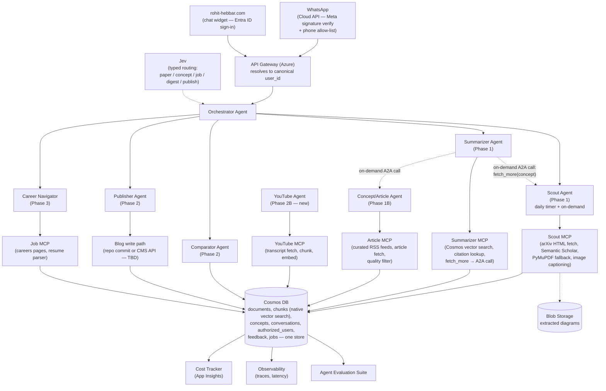
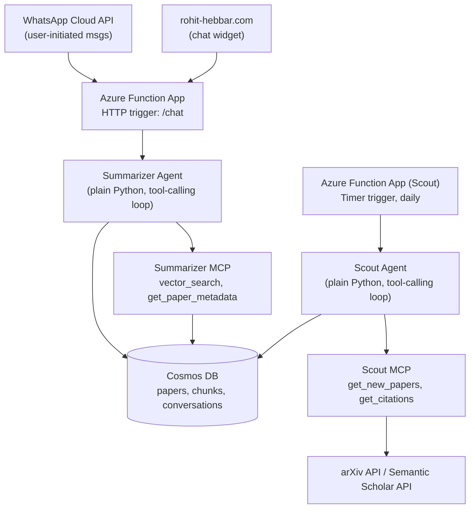
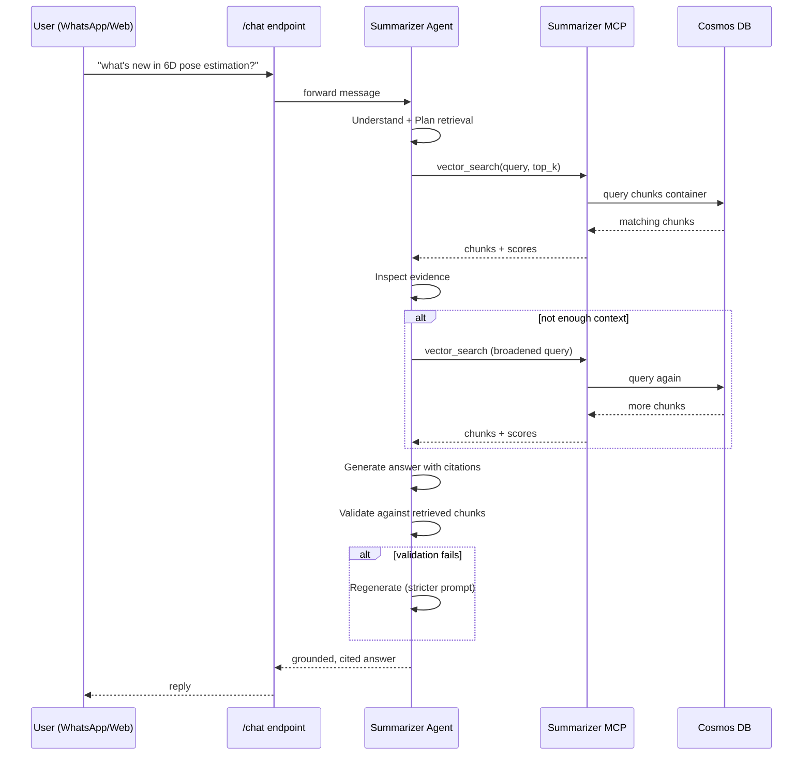

# Research & Career Agent Ecosystem — Design Plan v2

**Owner:** Rohit
**Purpose:** Learn the end-to-end agentic lifecycle (tool calling → single agent → multi-agent → A2A → deployed, real-use system) by building something used daily, that can grow into a personal research + career copilot.
**Status:** Planning — MVP not yet built.
**v2 changes:** storage split into Azure AI Search (retrieval) + Cosmos DB (operational data), per `Phase1_Architecture.md`; multimodal diagram ingestion; Entra ID auth layer added to the ecosystem diagram; the Scout↔Summarizer on-demand call is now shown as real A2A, not just a shared store; Concept/Article Agent and a new **YouTube Agent** added to the roadmap; a sourced cost estimate added (§9).

---

## 1. Vision (end state)

The full system you described, restated as one ecosystem:

- **Research assistant:** daily-updated knowledge of new papers in your fields (robotics, CV, embodied AI, VLA, JEPA), chattable on WhatsApp while walking, and on your website.
- **Publishing:** the assistant writes and posts blog content (with diagrams) to rohit-hebbar.com from what it's read.
- **Career/PhD navigator:** tracks Siemens robotics roles and PhD program requirements, ingests job descriptions, checks them against your resume, and tells you the gap.
- **One conversational surface:** ideally, you ask one WhatsApp thread anything — a paper, a job posting, "am I ready for a robotics PhD yet" — and it routes to the right capability.

This is a legitimate long-term product vision. It is not a legitimate **first build.**

## 2. Is this too much? Direct answer.

Yes, as a single MVP. Not because any one piece is hard, but because it is actually **three different problem domains** wearing one UI:

| Domain | Core problem | Tools needed |
|---|---|---|
| A. Research Assistant | Semantic retrieval + grounded summarization over papers | arXiv API, Semantic Scholar API, vector search |
| B. Publishing | Turning findings into a posted artifact on an external site | Diagram generation, your site's CMS/repo write path (**unknown to me — see open question below**) |
| C. Career Navigator | Structured extraction + matching (JD → requirements → resume gap) | Job board/careers page scraping, resume parsing, a matching/scoring step |

A and C in particular are not the same agent doing two things — they're two different agents with different tools, different data shapes, and different failure modes. Building both before either works end-to-end is exactly the trap your own mentor-instructions doc warns against: *"Never recommend unnecessary complexity... Do not introduce [X] until [Y] becomes difficult to maintain."* Applied here: don't build the career navigator until the research assistant is deployed and you're actually using it.

**The fix isn't cutting the vision — it's sequencing it.** Below is the full ecosystem architecture (so nothing is lost), followed by a strict phase order, with Phase 1 being the only thing we build right now.

## 3. Full ecosystem architecture (target state, not Phase 1)



**Agent roles, restated:**

| Agent | Trigger | Job | Phase |
|---|---|---|---|
| Scout (Paper Agent) | Daily timer + on-demand A2A call from Summarizer | Fetch new papers, score relevance, multimodal-index (text + diagrams) | 1 |
| Summarizer | On demand (chat) | RAG + grounded answer with retry/validation loop; calls Scout/Concept agent when evidence is thin | 1 |
| Concept/Article Agent | Weekly timer + on-demand | Fetch web articles/explainers per tracked concept, quality-filter, index | 1B |
| Orchestrator | Every request | Route intent (via Jev) to the right agent | 2 |
| Comparator | On demand | Cross-paper comparison | 2 |
| Publisher | Weekly timer or on demand | Draft + post a blog entry with a diagram | 2 |
| **YouTube Agent** (new) | On demand + weekly timer | Fetch transcripts of videos on a tracked concept, chunk, embed, index — same pattern as Concept/Article Agent, tagged by the same `concept_id` | 2B |
| Career Navigator (Job Scout, JD Extractor, Resume Matcher) | On demand / scheduled | Track roles, extract requirements, score resume fit | 3 |

PhD-track guidance and VLA/JEPA paper tracking are **not new agents** — they're tracked `concepts` (per `Phase1_Architecture.md` §7) that Scout, the Concept/Article Agent, and later the YouTube Agent all fetch against. One concept, three source types, one `concept_id` linking them — this is why the YouTube Agent needs no new design of its own: it's the Concept/Article Agent's pattern (fetch → transcript/text → chunk → embed → tag with `concept_id`) with a transcript API swapped in for a web search API. Deferred to Phase 2B — build it after the Concept/Article Agent is proven, not before.

## 4. Open question before Phase 2 (not blocking Phase 1)

I don't know how rohit-hebbar.com's blog is technically authored (Markdown files in a repo + static build? A headless CMS with an API? Something else?). Publisher's write path depends entirely on this. Flag it when we get there — no need to decide now.

## 5. Phased roadmap

| Phase | What ships | Why this order |
|---|---|---|
| **1 — MVP** | Scout + Summarizer, multimodal indexing, Entra ID + WhatsApp auth, deployed on WhatsApp and your website | Must be running and useful before anything else is added |
| **1B — Concept-driven ingestion** | `concepts` container, Concept/Article Agent, Scout becomes concept-aware (not just category-based) | Extends Phase 1's infra rather than replacing it — see `Phase1_Architecture.md` §7 |
| **2 — Growth** | Orchestrator + Jev routing, Comparator, Publisher → blog | Adds real multi-agent routing once single-agent chat is proven |
| **2B — YouTube Agent** | Transcript fetch/chunk/index, tagged by `concept_id`, same pattern as 1B | Same reasoning: prove the Concept/Article Agent pattern once before adding a third source type |
| **3 — Second app, shared infra** | Career Navigator (Job Scout, JD Extractor, Resume Matcher) | Different domain — built as its own agent set, reusing Orchestrator/Cosmos DB/WhatsApp patterns |
| **4 — Unification** | One Orchestrator routes between research and career domains in a single WhatsApp thread | Only after 1–3 each independently work |

---

# PHASE 1 — MVP (what we build now)

**Goal:** You can message a WhatsApp number from the metro, ask about a paper, and get a grounded, cited answer. The same assistant is embedded as a chat widget on rohit-hebbar.com. Scout runs unattended every day for two weeks without you touching it.

**Explicitly out of scope for Phase 1:** Orchestrator, Jev, Comparator, Publisher, blog posting, career navigator, feedback-driven memory. All deferred to later phases so this ships.

## 1.1 Architecture (Phase 1 only)



**The Summarizer's ReAct loop, as a sequence (one chat message):**



**Why plain Python, not LangGraph, for Phase 1:** matches your own principle — don't introduce an orchestration framework until a single agent's control flow becomes hard to maintain by hand. Two agents, no shared reasoning graph between them yet, so plain loops are the right call (same reasoning you used for Wound Care Agent).

## 1.2 Cosmos DB schema

**Container: `papers`**
```json
{
  "id": "arxiv:2509.xxxxx",
  "title": "...",
  "authors": ["..."],
  "abstract": "...",
  "categories": ["cs.RO", "cs.CV"],
  "published_date": "2026-09-20",
  "relevance_score": 0.83,
  "relevance_reason": "cites work on 6D pose estimation for bin picking",
  "indexed_at": "2026-09-27T04:00:00Z"
}
```

**Container: `chunks`** (partitioned by `paper_id`)
```json
{
  "id": "arxiv:2509.xxxxx#chunk3",
  "paper_id": "arxiv:2509.xxxxx",
  "chunk_index": 3,
  "text": "...",
  "embedding": [0.0123, -0.0456, ...]
}
```

**Container: `conversations`** (partitioned by `session_id`)
```json
{
  "id": "session_abc123",
  "channel": "whatsapp",
  "user_phone": "+91xxxxxxxxxx",
  "messages": [
    {"role": "user", "content": "what's new in 6D pose estimation this week?"},
    {"role": "assistant", "content": "...", "cited_papers": ["arxiv:2509.xxxxx"]}
  ],
  "updated_at": "2026-09-27T13:00:00Z"
}
```

## 1.3 Scout MCP tools

```python
get_new_papers(categories: list[str], since_date: str) -> list[Paper]
get_citations(paper_id: str) -> list[Paper]     # Semantic Scholar
get_paper_full_text(paper_id: str) -> str        # for chunking after relevance is confirmed
```

## 1.4 Summarizer MCP tools

```python
vector_search(query: str, paper_id: str | None, top_k: int) -> list[Chunk]
get_paper_metadata(paper_id: str) -> Paper
```

## 1.5 Scout agent loop (daily)

1. Call `get_new_papers(["cs.RO", "cs.CV"], since=yesterday)`.
2. For each paper: read title + abstract, decide relevant y/n against your stated interests (pose estimation, bin picking, embodied AI, VLA, JEPA). If borderline, call `get_citations` to check if it connects to work you already follow.
3. If relevant: call `get_paper_full_text`, chunk (~500 tokens, ~50 overlap), embed, write to `chunks`; write metadata + relevance_score to `papers`.
4. Log a run summary (papers seen, papers indexed) to Application Insights.

## 1.6 Summarizer agent loop (per message — the ReAct loop)

1. **Understand:** what is being asked (a specific paper? a topic? a comparison — comparisons get a "not yet, coming in Phase 2" reply for now).
2. **Plan retrieval:** which paper_id (if named) or open topic search.
3. **Call tool:** `vector_search`.
4. **Inspect evidence:** enough context? If not, broaden the query and retry (max 2 attempts).
5. **Generate:** answer with inline citations to paper IDs.
6. **Validate:** check every claim against retrieved chunks; if unsupported, regenerate once with a stricter prompt.
7. **Return** to whichever channel sent the message (WhatsApp or web widget), same API either way.

## 1.7 Deployment

- **Scout:** Azure Function App, timer trigger, daily at a fixed UTC time.
- **Summarizer:** Azure Function App, HTTP trigger, one `/chat` endpoint used by both channels.
- **WhatsApp:** Meta Cloud API webhook → same `/chat` endpoint. Free for user-initiated conversations (your case).
- **Website widget:** a small chat component added to rohit-hebbar.com (Vercel frontend) calling the same `/chat` endpoint with CORS enabled — same pattern as your existing portfolio RAG chatbot, new route.
- **Model:** Azure OpenAI GPT-4o-mini (or GPT-4.1-mini) for both agents. Cost at this volume: well under $1/month.

## 1.8 Evaluation (Phase 1)

- **Scout:** weekly spot-check — did it flag the papers you'd have flagged yourself? Track false negatives (missed a paper you cared about) more closely than false positives.
- **Summarizer:** a hand-built set of 15–20 questions with known correct paper(s) and expected evidence. Score retrieval (did the right chunk come back?) and faithfulness (does every claim in the answer trace to a retrieved chunk?).

## 1.9 MVP success criteria

- [ ] You can WhatsApp the bot from the metro and get a cited, grounded answer within a few seconds.
- [ ] The same assistant works as a widget on rohit-hebbar.com.
- [ ] Scout runs unattended daily for 2 consecutive weeks with no manual fixes.
- [ ] On your 15–20 question eval set, faithfulness holds (no unsupported claims) on at least 90%.
- [ ] You've actually used it to understand a real paper at least 5 times, unprompted.

Only once these hold do we move to Phase 2 (Orchestrator, Jev, Comparator, Publisher).

**Phase gate — nothing to the right starts until everything to the left is checked off:**

```mermaid
flowchart LR
    subgraph P1["Phase 1 — MVP"]
        direction TB
        A1["Scout + Summarizer"]
        A2["Deployed: WhatsApp + web widget"]
        A3["2 weeks unattended Scout"]
        A4["Eval set: faithfulness ≥ 90%"]
    end
    subgraph P2["Phase 2 — Growth"]
        direction TB
        B1["Orchestrator + Jev routing"]
        B2["Comparator Agent"]
        B3["Publisher Agent → blog"]
    end
    subgraph P3["Phase 3 — Second app"]
        direction TB
        C1["Job Scout"]
        C2["JD Extractor"]
        C3["Resume Matcher"]
    end
    subgraph P4["Phase 4 — Unification"]
        direction TB
        D1["One Orchestrator across<br/>research + career domains"]
    end

    P1 ==gate: success criteria met==> P2
    P2 ==gate: proven useful==> P3
    P3 ==gate: both domains stable==> P4
```



---

## 6. What we build first, concretely

Order of implementation within Phase 1:
1. Cosmos DB containers + a script to backfill ~2 weeks of papers manually (so Summarizer has something to answer against on day one).
2. Scout agent loop, run locally against real APIs, verify it indexes sensibly.
3. Summarizer agent loop, run locally, verify the ReAct + validation loop against your eval set.
4. Deploy both as Azure Function Apps.
5. Wire up the WhatsApp webhook.
6. Add the website widget.
7. Let it run for a week before touching Phase 2.

---

## 9. Cost estimate — sourced against current Azure pricing (revised, cost-optimized)

The original design priced out to ~$78–85/month, which is too high for a personal project — you asked for under $15–20/month. Rather than accept that, three swaps bring it down to **~$1–3/month**. Full reasoning and trade-offs are in `Phase1_Architecture.md` §0; this section has the numbers.

**One correction first:** the $200 Azure credit is a **one-time, 30-day trial credit** for new accounts, not a recurring monthly allowance — [Microsoft Azure Free Tier: $200 Credit for 30 Days](https://resourify.com/resources/azure). It's useful for the initial build (testing higher tiers risk-free), but the design below targets low *ongoing* cost regardless of the credit, since it runs out.

### The three swaps

| Was (v1) | Now (v2) | Why it's cheaper | Source |
|---|---|---|---|
| Azure AI Search Basic tier (~$75/mo) | **Cosmos DB's built-in vector search** | Same lifetime-free tier (1,000 RU/s + 25 GB) already in the plan covers it — no second paid service | [Vector search in Azure Cosmos DB for NoSQL](https://learn.microsoft.com/en-us/azure/cosmos-db/vector-search) |
| Document Intelligence OCR per paper | **arXiv's native HTML** (`arxiv.org/html/<id>`), PyMuPDF fallback for older papers | Avoids the $10/1,000-page charge almost entirely | [arXiv now offers papers in HTML format](https://blog.arxiv.org/2023/12/21/accessibility-update-arxiv-now-offers-papers-in-html-format) |
| Grounding with Bing Search, $35/1,000 queries | **Curated RSS feeds** from known ML/robotics blogs | $0 recurring, and arguably better source quality | [Bing Search API retirement](https://ppc.land/microsoft-ends-bing-search-apis-on-august-11-alternative-costs-40-483-more/) — the cheaper old tiers were retired Aug 2026 |

### Per-service rates (as published)

| Service | Rate | Free allowance | Source |
|---|---|---|---|
| **Cosmos DB (serverless, vector search included)** | $0.25 per 1M RUs | **Lifetime free tier: 1,000 RU/s + 25 GB storage** — vector search costs nothing beyond normal RU/storage | [Cosmos DB Serverless pricing](https://azure.microsoft.com/en-us/pricing/details/cosmos-db/serverless/), [Vector search docs](https://learn.microsoft.com/en-us/azure/cosmos-db/vector-search) |
| **Blob Storage** | Pennies/GB/month (hot tier) | 5 GB always-free | [Azure Free Tier Guide 2026](https://agentdeals.dev/azure-free-tier-2026) |
| **Azure Functions (Consumption)** | Pay above free grant | **1M executions + 400K GB-seconds/month, always-free** | [Azure Free Tier Guide 2026](https://agentdeals.dev/azure-free-tier-2026) |
| **Azure OpenAI — GPT-4o-mini** | $0.15/1M input, $0.60/1M output tokens | No standing free tier | Azure OpenAI pricing (checked earlier in this project) |
| **Azure OpenAI — embeddings (text-embedding-3-small, 512-dim)** | ~$0.02/1M tokens, and cheaper still at reduced dimensions | — | Azure OpenAI pricing page |
| **Document Intelligence** (fallback path only, rare) | $10.00 per 1,000 pages | 500 pages/month free (F0) | [DocuOCR — Azure Document Intelligence Pricing 2026](https://docuocr.com/blog/azure-document-intelligence-pricing) |
| **WhatsApp Cloud API** | Free for user-initiated conversations | Unlimited (your usage pattern) | Confirmed earlier in this project against Meta's current pricing |
| **Microsoft Entra ID** | Free tier | Up to 50,000 monthly active users | Standard Entra ID free tier |
| **Azure free account credit** | — | **$200, one-time, 30 days** — not recurring | [Azure Free Tier: $200 Credit and Limits](https://costbench.com/software/cloud-infrastructure/azure/free-plan/) |

### Realistic monthly total (revised)

| Component | Monthly cost |
|---|---|
| Cosmos DB (documents, chunks, concepts, conversations, vector search) | $0 (within lifetime free tier) |
| Blob Storage (diagram images) | $0 (within 5 GB free tier for a long while) |
| Azure Functions (Scout + Summarizer + Concept agent) | $0 (within free execution grant) |
| Document Intelligence (rare PDF fallback only) | $0–1 |
| Azure OpenAI (GPT-4o-mini calls + embeddings + image captioning) | $1–3 |
| WhatsApp, Entra ID | $0 |
| Concept/Article Agent (RSS-based) | $0 |
| **Total** | **~$1–3/month** |

If you later add Grounding with Bing for open-web search on top of the RSS feeds, budget an extra **$2–4/month** at light use (~50–100 queries/month) — still comfortably inside a $15–20 ceiling.

**Bottom line:** the redesigned system runs for the cost of a coffee a month, indefinitely — not just during the trial credit — because the two previously-dominant cost centers (managed search infrastructure, per-page OCR) were solved with free-tier-native alternatives rather than paid services sized for production traffic you don't have.
