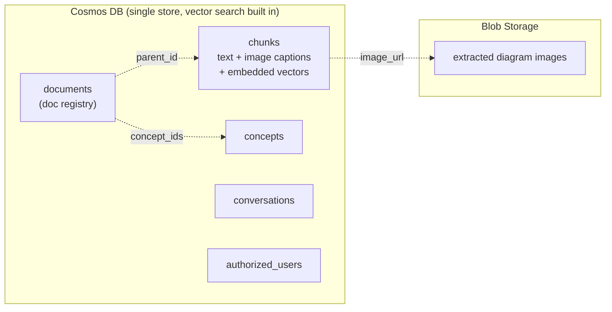
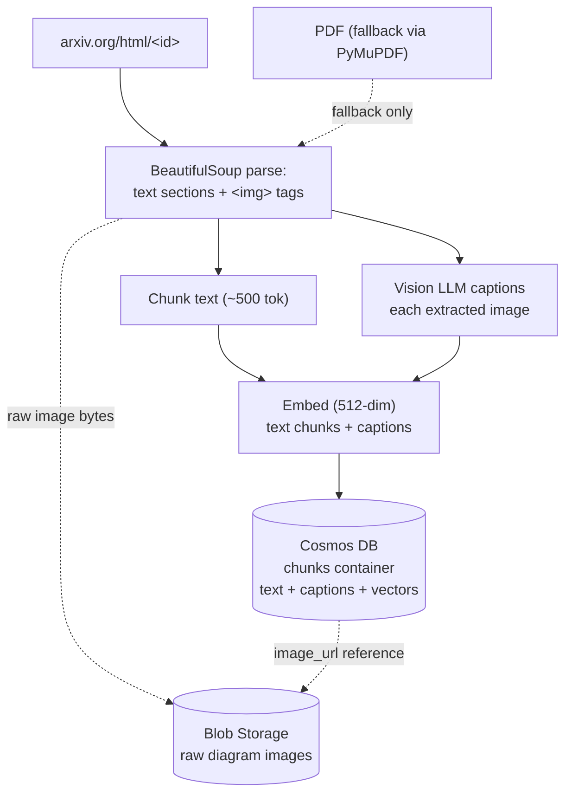
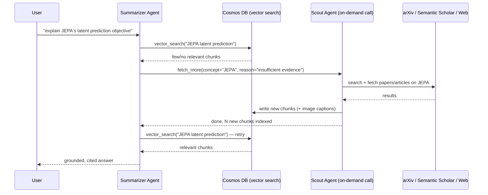
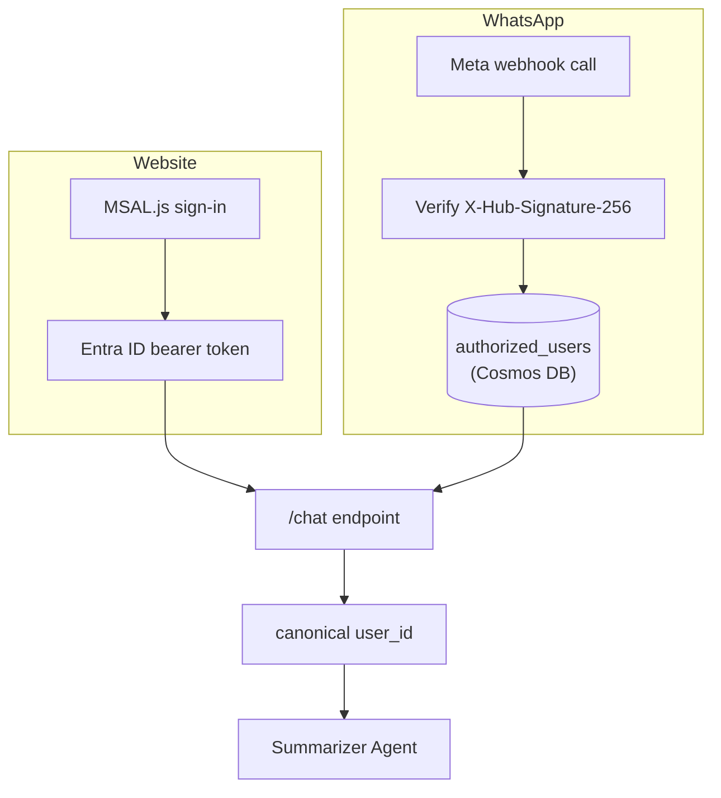
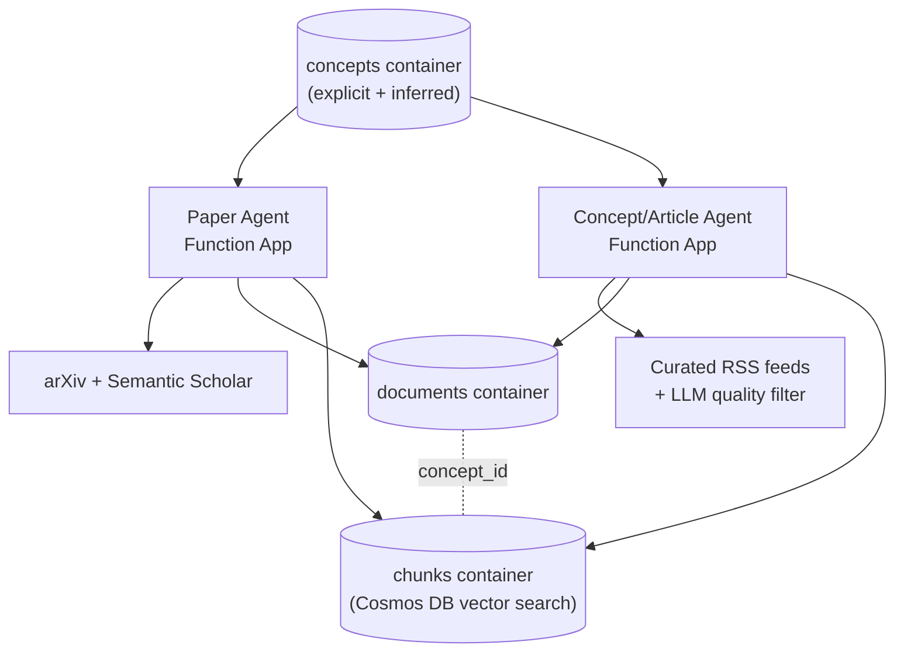

# Phase 1 Architecture — Detailed Design (v2 — cost-optimized)

**Project:** Research & Career Agent Ecosystem
**Scope of this doc:** Phase 1 (+ the Phase 1B extension below), in implementation-ready detail.
**Companion doc:** `PaperAgent_Ecosystem_Plan_v1.md` (overall vision and phasing — this doc drills into Phase 1 only).
**v2 change:** the v1 design (Azure AI Search + Document Intelligence + Bing Search) priced out to ~$78–85/month steady-state — too high for a personal project. This version replaces the three expensive pieces with near-equivalent free/cheap alternatives, targeting **~$1–3/month**. See §0 for the reasoning and the honest trade-offs.

---

## 0. What changed, and why (cost-driven redesign)

The original design wasn't wrong on capability — Azure AI Search's managed multimodal pipeline is genuinely good. It was wrong on **fit for a solo, low-volume project**: you were paying for always-on managed infrastructure sized for production traffic you don't have. Three swaps fix this, each verified against current docs rather than assumed:

| Was | Now | Saves | Trade-off |
|---|---|---|---|
| Azure AI Search (Basic tier, ~$75/mo) | **Cosmos DB's own native vector search** | ~$75/month | You write the retrieval query yourself (a few lines); no managed hybrid-search UI. Fine at your scale. |
| Document Intelligence OCR on every PDF (~$0–10/mo) | **Fetch arXiv's native HTML** for the paper first; fall back to PyMuPDF (already in your stack) only when HTML isn't available | ~$5–10/month | A handful of very old papers may lack HTML and need the fallback path — same PyMuPDF you already use elsewhere in your portfolio. |
| Grounding with Bing Search, $35/1,000 queries (Phase 1B) | **Curated RSS feeds** from known-good ML/robotics blogs, for the article side of Phase 1B | ~$3–10/month | Less open-ended than free-text web search, but the sources are higher-quality anyway (curated feeds beat noisy search results for "explain this concept" articles) |

**Cosmos DB vector search is real and current** — it's Cosmos DB for NoSQL's built-in integrated vector database, not a preview toy: [Vector search in Azure Cosmos DB for NoSQL](https://learn.microsoft.com/en-us/azure/cosmos-db/vector-search). It costs nothing beyond normal RU/storage consumption, and it works on the same lifetime-free tier (1,000 RU/s + 25 GB) already in the plan. Below 1,000 vectors it does a full scan automatically (still fine, even faster to reason about); past that, it supports `quantizedFlat`/`diskANN` indexes up to 4,096 dimensions.

**arXiv has offered native HTML since December 2023** — [arXiv now offers papers in HTML format](https://blog.arxiv.org/2023/12/21/accessibility-update-arxiv-now-offers-papers-in-html-format), fetched from `arxiv.org/html/<id>`. This means no OCR step at all for most papers: fetch the HTML, parse text with BeautifulSoup, and — genuinely useful for you — **diagrams come through as ordinary `` tags with surrounding context**, no image-extraction skill needed to find them.

Everything else from the v1 design is unchanged: same schema shape, same agents, same tools, same auth model. Only *where* chunks live and *how* documents get ingested changed.

---

## 1. Storage architecture: two stores, different jobs (revised)

| Store | Holds | Why |
|---|---|---|
| **Cosmos DB (NoSQL, integrated vector search)** | Everything: document registry, concepts, conversations, users, feedback, **and** the chunks + vectors themselves | One store, no second service to pay for or operate, and its vector search is native — not bolted on |
| **Blob Storage** | Extracted diagram images | Images are binary; they don't belong inline in a document database record, just referenced by URL |



## 2. Multimodal ingestion — how diagrams get stored and explained (revised, no Document Intelligence needed)

The goal is unchanged — diagrams get a text caption you can cite, plus a stored image you can be shown — but the pipeline is now nearly free:

1. **Fetch:** try `arxiv.org/html/<id>` first. If it 404s (older paper, or the source didn't compile to HTML), fall back to the PDF and extract text with **PyMuPDF** — already part of your stack, and free (just compute).
2. **Parse:** BeautifulSoup walks the HTML, splitting it into text sections and pulling out every `` tag with its surrounding paragraph as context (this replaces the "Document Layout skill" from v1 — the same job, done with two well-known free libraries instead of a paid Azure skill).
3. **Chunk text:** same as before — ~500 tokens, ~50 overlap.
4. **Caption images:** one vision-LLM call per extracted diagram, same **image verbalization** idea as before — e.g. *"Five-stage 6D pose estimation pipeline: RGB-D input → point cloud segmentation → PointNet feature extraction → pose regression → ICP refinement."* This is still the right call over raw multimodal embeddings, for the same reason as before: a caption can be quoted and cited in an answer; a bare image vector can't.
5. **Embed both** (text chunks and image captions) with the same embedding model, at a **reduced dimension (e.g. 512, via the embedding API's `dimensions` parameter)** rather than the default 1536 — this keeps each vector under Cosmos DB's 505-dimension `flat` index limit at low vector counts, and cuts storage per chunk by roughly 3x, which is free money for a cost-sensitive design.
6. **Store the raw image** in Blob Storage; the Cosmos DB chunk record keeps the URL.



## 3. Schema — doc_id / chunk_id, exactly as you described

**Cosmos DB — `documents` container** (the parent record; covers both papers and articles):
```json
{
  "id": "doc_arxiv_2509xxxxx",
  "doc_type": "paper",                
  "source": "arxiv",
  "concept_ids": ["concept_6d-pose-estimation", "concept_bin-picking"],
  "title": "...",
  "authors": ["..."],
  "url": "https://arxiv.org/abs/2509.xxxxx",
  "published_date": "2026-09-20",
  "relevance_score": 0.83,
  "indexed_at": "2026-09-27T04:00:00Z"
}
```

**Cosmos DB — `concepts` container** (new — the thing that links papers and articles together):
```json
{
  "id": "concept_6d-pose-estimation",
  "name": "6D Pose Estimation",
  "aliases": ["6DoF pose estimation", "object pose estimation"],
  "category": "robotics/perception",
  "source": "user_stated",
  "status": "active",
  "last_ingested_at": "2026-09-27T04:00:00Z"
}
```

**Cosmos DB — `chunks` container** (partitioned by `parent_id`; vector search enabled on `content_vector`):
```json
{
  "id": "doc_arxiv_2509xxxxx#chunk3",
  "parent_id": "doc_arxiv_2509xxxxx",
  "content": "...",
  "content_vector": [0.0123, -0.0456, ...],
  "content_type": "text",
  "concept_ids": ["concept_6d-pose-estimation"]
}
```
```json
{
  "id": "doc_arxiv_2509xxxxx#img2",
  "parent_id": "doc_arxiv_2509xxxxx",
  "content": "Five-stage 6D pose estimation pipeline: RGB-D input → point cloud segmentation → PointNet feature extraction → pose regression → ICP refinement.",
  "content_vector": [0.0091, 0.0344, ...],
  "content_type": "image_caption",
  "image_url": "https://<blob>.blob.core.windows.net/diagrams/doc_arxiv_2509xxxxx_img2.png",
  "concept_ids": ["concept_6d-pose-estimation"]
}
```

`content_vector` uses **512 dimensions** (not the embedding model's default 1536) — deliberately, to fit Cosmos DB's `flat` vector index (505-dimension cap at low vector counts) and to cut storage per chunk roughly 3x. `concept_ids` is duplicated onto every chunk (denormalized) so Summarizer can filter by concept in the same query, without a separate join back to the `documents` container.

## 4. Are the agents talking to each other? Direct answer.

**Right now, in the original Phase 1 design: no.** Scout writes to the stores; Summarizer reads from the stores. They never call each other. That's a **shared-store pattern** (sometimes called a blackboard architecture) — simpler, decoupled, and fine for a daily-batch-then-query workflow. It is *not* agent-to-agent communication in the sense you mean.

**With the concept-driven redesign, one real A2A case appears, and it's worth building:** when you ask Summarizer about a concept it hasn't indexed enough for, instead of shrugging, it should be able to **call Scout (or the new Concept/Article agent) synchronously, on demand**, to go fetch more right now, then retry retrieval. That's a genuine agent handing off a job to another agent mid-conversation — the real thing you were asking about earlier in this project.



This is the one addition I'd make to Phase 1's design: Scout gets **two triggers**, not one — the daily timer (unattended, category-based) *and* an HTTP endpoint that Summarizer can call directly (on-demand, concept-based). Same agent, same tools, two ways in.

## 5. Agents and their tools

| Agent | Trigger(s) | Tools it can call |
|---|---|---|
| **Scout (Paper agent)** | Daily timer + on-demand call from Summarizer | `arxiv_search(concept_or_categories, since_date)`, `semantic_scholar_search(concept)`, `semantic_scholar_citations(paper_id)`, `fetch_arxiv_html(paper_id)` *(primary path)*, `fetch_and_extract_pdf(paper_id)` *(PyMuPDF fallback)*, `caption_image(image)` *(vision LLM)*, `embed(text, dimensions=512)`, `write_chunks_to_cosmos(chunks)`, `write_document_to_cosmos(document_record)` |
| **Concept/Article agent** *(Phase 1B, §7)* | Weekly timer + on-demand call from Summarizer | `fetch_rss_feeds(concept)` *(curated blog/source list)*, `fetch_article(url)`, `extract_and_chunk(html)`, `filter_quality(article)` *(LLM judge — drops low-quality results)*, `embed(text, dimensions=512)`, `write_chunks_to_cosmos(chunks)`, `write_document_to_cosmos(document_record)` |
| **Summarizer** | Every chat message (WhatsApp + web) | `vector_search(query, concept_ids, top_k)` *(Cosmos DB native)*, `get_document_metadata(doc_id)`, `get_image(image_url)`, `fetch_more(concept, reason)` *(→ calls Scout or Concept agent)*, `validate_claims(answer, chunks)` |

Everything else (relevance scoring inside Scout, validation inside Summarizer) is reasoning the agent does itself, not a separate tool call.

## 6. Authentication — Microsoft Entra ID (Azure AD), per channel

One mechanism doesn't cover both channels, because WhatsApp's webhook is Meta calling *you*, not a user logging in.

**Website widget:**
- Register an app in Microsoft Entra ID (App Registration).
- Frontend uses MSAL.js to sign you in; you get a bearer access token.
- The Function App validates that token — either via **App Service Authentication ("Easy Auth")**, which validates Entra ID tokens with no custom code, or explicit JWT validation in your function if you want more control.
- Today: restrict to your own tenant/account (effectively just you). Later, if you open this to others, swap to **Microsoft Entra External ID (CIAM)**, which is built for exactly this — customer-facing sign-up/sign-in — without re-architecting anything else.

**WhatsApp:**
- No interactive login is possible — Meta calls your webhook directly.
- Trust comes from two things instead: (1) verifying Meta's request signature (`X-Hub-Signature-256`, using your app secret) to confirm the call is genuinely from Meta, and (2) an **`authorized_users`** container in Cosmos DB mapping phone numbers to a canonical `user_id`. Today it's one row (you). Adding a friend later is adding one row — not an Entra ID concept, since the phone number *is* the identity here.

**Unifying point:** both paths resolve to the same canonical `user_id` before hitting Summarizer, so the agent logic never needs to know which channel authenticated the request.



## 7. Phase 1B — concept-driven, multi-source ingestion (papers + articles)

This is real and worth building, but it's a **second slice of Phase 1**, built after the plain Scout+Summarizer loop is working — not folded into day one. Reasoning: everything in §1–6 above (multimodal indexing, doc_id/chunk_id schema, Entra auth) is required infrastructure regardless. Concept-driven multi-source fetching is a capability upgrade on top of it, and it's much easier to debug relevance scoring for one source (arXiv) before adding a second, noisier one (open web articles).

**How "depending on the user" works, concretely:**
- **Explicit concepts:** seeded from your stated interests (pose estimation, bin picking, VLA, JEPA, embodied AI) as rows in the `concepts` container. You can add more by just saying so in chat — no UI needed yet.
- **Implicit concepts:** if Summarizer notices you asking about something not yet tracked (e.g., three questions about "world models" with thin results), it proposes adding it as a tracked concept — you confirm, it doesn't add silently.
- **Fetching papers for a concept:** arXiv search API using the concept name as the query, filtered to your categories; Semantic Scholar's own search (not just citations) for broader concept coverage.
- **Fetching articles for a concept — cost-optimized version:** rather than a paid web-search API ($35 per 1,000 queries via Grounding with Bing, since the older cheaper Bing Search tiers were retired in August 2026), use a **curated list of RSS feeds** from known-good sources — official research blogs (Google DeepMind, Meta AI/FAIR, BAIR), Papers with Code, distill.pub-style explainers, arXiv Sanity. Filter each new item's title/summary against your tracked concepts, and only fully fetch + index articles that match — an **LLM quality filter** still matters here, but it's filtering a smaller, higher-quality candidate pool, not open web search results. This is $0 recurring cost and arguably better source quality for "explain this concept" needs than unconstrained search.
- **Two Function Apps, linked by `concept_id`, exactly as you described:** Paper agent and Concept/Article agent are separate deployments (different data sources, different noise profiles, different failure modes — a real justification for splitting them, same test we've used throughout this project), both writing to the same `documents` and `chunks` containers in Cosmos DB, tagged with the same `concept_ids`.
- **If you later want true open-web search** (beyond the curated feed list), Grounding with Bing is there — just budget for it deliberately (even light use, ~50–100 queries/month, is $2–4/month) rather than defaulting to it.



**Explicitly deferred, not designed here:** a YouTube transcript extractor agent. Same pattern as the Concept/Article agent (fetch → transcript → chunk → embed → tag with `concept_id`), so it slots into this architecture cleanly later — a third Function App, same `documents`/index/`concept_id` pattern. No new design needed until Phase 1B is working.

## 8. Updated Phase 1 build order

1. Cosmos DB: `documents`, `chunks` (vector search enabled, 512-dim), `concepts`, `conversations`, `authorized_users` containers.
2. Blob Storage container for raw diagram images.
3. Scout agent (category-based, daily timer): arXiv HTML fetch → BeautifulSoup parse → chunk → caption images → embed (512-dim) → write to Cosmos DB. Get this working end-to-end, including the PyMuPDF fallback path, before adding on-demand fetch.
4. Summarizer agent (ReAct loop against Cosmos DB's native vector search) — plain category-based retrieval first.
5. Wire Scout's on-demand HTTP endpoint + Summarizer's `fetch_more` tool (the real A2A handoff, §4).
6. Entra ID auth on the website path; phone allow-list + signature verification on WhatsApp.
7. Deploy both channels.
8. **Phase 1B** (only after the above is stable for ~1-2 weeks): `concepts` container, Concept/Article agent (RSS-based), concept-driven Scout queries.

## 9. Cost impact of this revision

See `PaperAgent_Ecosystem_Plan_v1.md` §9 for the full sourced breakdown. Summary: dropping Azure AI Search, Document Intelligence, and paid web search brings steady-state cost from ~$78–85/month down to **~$1–3/month** — comfortably under a $15–20/month target, with no reliance on the one-time $200 trial credit.
